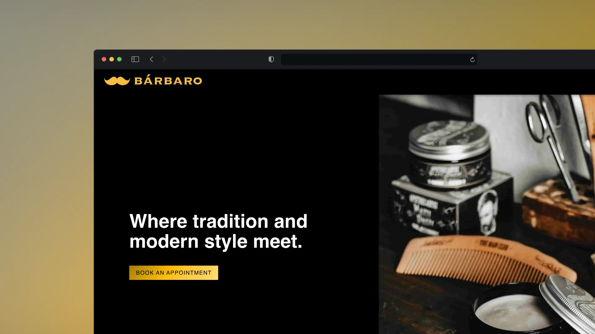
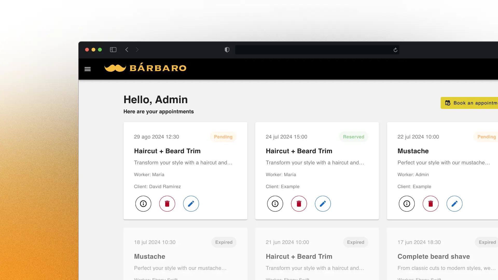

# Bárbaro: Gestión de una barbería

Bárbaro es una plataforma de gestión diseñada para una barbería hipotética. Ofrece intranets personalizadas para diferentes roles, como administrador, empleado y cliente. La aplicación incluye funciones para gestionar citas, horarios, servicios y empleados, lo que mejora tanto la eficiencia operativa como la experiencia del usuario en la administración de la barbería.


## Características

- **Sistema de citas:** Permite a los clientes agendar citas fácilmente y a los empleados consultar sus horarios de trabajo.
- **Gestión de horarios:** Facilita la programación de turnos de trabajo y la disponibilidad del personal.
- **Administración de servicios y empleados:** Simplifica la gestión de servicios ofrecidos y del personal de la barbería.
- **Interfaces personalizadas:** Diferentes intranets adaptadas a las necesidades de administradores, empleados y clientes.

## Tecnologías Utilizadas

- **Frontend:** Vue.js
  - **Componentes:** Vuetify
  - **Gestor de estado:** Pinia
  - **Empaquetado:** Vite
- **Backend:** Laravel

### Requisitos

- Node.js
- PHP
- Composer
- MySQL o PostgreSQL

### Instrucciones

1. **Clonar el repositorio:**

   ```bash
   git clone https://github.com/davidzz-code/BarBaro_frontend.git
   cd BarBaro_frontend
   ```
   
2. **Instalar dependencias de Vue.js:**

   ```bash
   npm install
   ```
3. **Iniciar el servidor de desarrollo:**
   ```bash
   npm run dev
   ```
4. **Configurar backend:**  
  Si aún no has configurado el backend, visita el [repositorio del backend](https://github.com/davidzz-code/BarBaro_backend.git) y sigue las instrucciones para iniciar la web

### Uso

Accede a la plataforma a través de http://localhost:3000 para el frontend.
Una vez tanto frontend como backend estén funcionando, regístrate y explora las funcionalidades según tu rol asignado (administrador, empleado o cliente).

### Capturas de pantalla de la web

  


